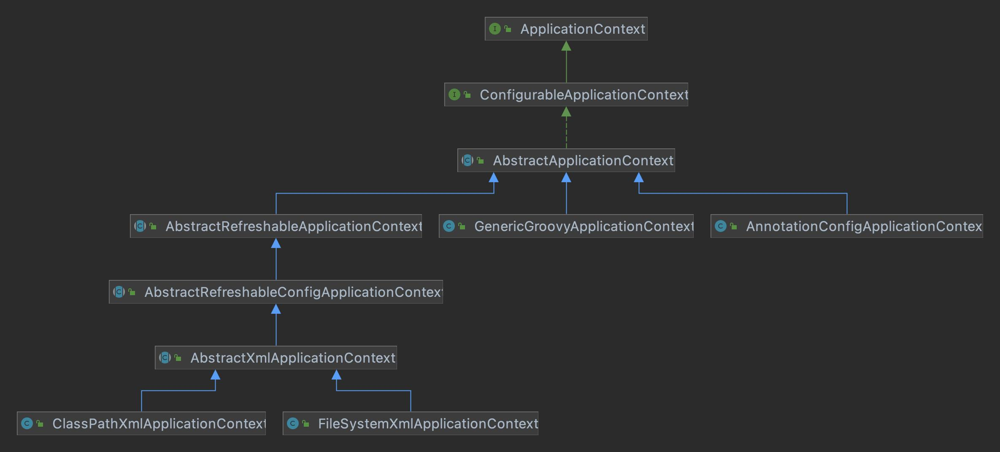

## 核心流程
1. 以 `ClassPathXmlApplicationContext` 为例, new `ClassPathXmlApplicationContext`对象

2. `setConfigLocations` 根据提供的文件路径，加载成配置文件数组 核心逻辑创建`ConfigurableEnvironment`和处理`ClassPathXmlApplicationContext`传入的字符串中的占位符。

   `resolvePath` 中`getEnvironment()`会创建一个`StandardEnvironment`对象，然后调用其 `resolveRequiredPlaceholders(path)`处理占位符

3. `refresh`方法

    1. `synchronized(startupShutdownMonitor)` 加锁防止 refresh 还没结束,再次启动或销毁容器而引起冲突
    2. `prepareRefresh` 做一些准备工作，记录容器的启动时间、标记“已启动”状态、检查环境变量(value 为null 会抛出异常中止启动)
    3. `obtainFreshBeanFactory` 负责了BeanFactory的初始化、Bean的加载和注册等事件, 加载`beanDefiniton`
    4. `prepareBeanFactory` 设置beanFactory的类加载器，添加几个`BeanPostProcessor(ApplicationContextAwareProcessor, ApplicationListenerDetector, LoadTimeWeaverAwareProcessor)`以及注册几个特殊的bean(eg: `environment，systemProperties、SystemEnvironment、applicationStartup`)
    5. `postProcessBeanFactory` 处理实现了`BeanFactoryPostProcessor`接口的bean,那么在容器初始化以后，Spring 会负责调用里面的 `postProcessBeanFactory` 方法
    6. `invokeBeanFactoryPostProcessors` 调用`BeanFactoryPostProcessor`各个实现类的`postProcessBeanFactory(factory)` 方法
    7. `registerBeanPostProcessors` 处理`BeanPostProcessor` 的实现类，此接口有两个方法: `postProcessBeforeInitialization` 和 `postProcessAfterInitialization`分别会在Bean初始化之前和初始化之后得到执行
    8. `initMessageSource`初始化当前 `ApplicationContext` 的 `MessageSource`
    9. `initApplicationEventMulticaster` 初始化当前 `ApplicationContext` 的事件广播器，首先使用用户配置的自定义广播器，没有的话就使用默认的
    10. `onRefresh` 拓展方法 子类可以处理
    11. `registerListeners`注册事件监听器
    12. `finishBeanFactoryInitialization` 在这之前 bean 还没被初始化，该方法负责初始化所有的没有设置懒加载的singleton bean
    13. `finishRefresh` 清除缓存，初始化`lifecycleProcessor`,启动所有实现`lifecycle`的bean,发布 `contextRefreshedEvent`事件，检查spring.liveBeansView.mbeanDomain是否存在，有就会创建一个MBeanServer
    14. `finally` 方法 `resetCommonCaches`  清除缓存
    


## demo工程示例代码
### 简单的接口和实现类
```java
public interface IocService {
    String hello();
}
public class IocSerivceImpl implements IocService {
    @Override
    public String hello() {
        return "hello";
    }
}
```
### 新建一个application-ico.xml (spring 配置文件)
```xml
<?xml version="1.0" encoding="UTF-8" ?>
<beans xmlns:xsi="http://www.w3.org/2001/XMLSchema-instance"
		xmlns="http://www.springframework.org/schema/beans"
		xsi:schemaLocation="http://www.springframework.org/schema/beans http://www.springframework.org/schema/beans/spring-beans.xsd"
		default-autowire="byName">

	<bean id="iocService" class="org.springframework.test.spring.IocServiceImpl"/>
</beans>
```
### IocTest 启动spring
```java
public class IocTest {
	private static final String PATH = "/org/springframework/test/spring/";
	@Test
	public void testIoc() {
		ApplicationContext context = new ClassPathXmlApplicationContext(PATH + "application-ioc.xml");
		IocService iocService = context.getBean(IocService.class);
		System.out.println(iocService.hello());
	}
}
```
## ClassPathXmlApplicationContext
上述demo代码中，通过`ClassPathXmlApplicationContext`来加载spring配置文件, 核心类关系可以见下图：



```java
public class ClassPathXmlApplicationContext extends AbstractXmlApplicationContext {
    private Resource[] configResources; // LJ MARK: 配置文件数组
    public ClassPathXmlApplicationContext(
            String[] configLocations, boolean refresh, @Nullable ApplicationContext parent)
            throws BeansException {

        super(parent);
        // LJ MARK: 根据提供的路径, 处理成文件数组 (以分号、逗号、空格、tab、换行符分割)
        setConfigLocations(configLocations);
        if (refresh) {
            refresh();
        }
    }
}
```
`setConfigLocations` 方法
```java
public abstract class AbstractRefreshableConfigApplicationContext {
	public void setConfigLocations(@Nullable String... locations) {
		if (locations != null) {
			Assert.noNullElements(locations, "Config locations must not be null");
			this.configLocations = new String[locations.length];
			for (int i = 0; i < locations.length; i++) {
				this.configLocations[i] = resolvePath(locations[i]).trim();
			}
		}
		else {
			this.configLocations = null;
		}
	}
    protected String resolvePath(String path) {
        /**
         * LJ MARK resolveRequiredPlaceholders 最终会执行到{@link PropertyPlaceholderHelper#parseStringValue(java.lang.String, org.springframework.util.PropertyPlaceholderHelper.PlaceholderResolver, java.util.Set)} 该方法主要是负责处理 ${} 占位符
         */
        return getEnvironment().resolveRequiredPlaceholders(path);
    }
    // LJ MARK 该方法涉及创建env 的操作
    public ConfigurableEnvironment getEnvironment() {
        if (this.environment == null) {
            this.environment = createEnvironment();
        }
        return this.environment;
    }
    // LJ MARK 创建了一个 StandardEnvironment 这个类中的 customizePropertySources 方法就会往资源列表中添加Java进程中的变量和系统的环境变量
    protected ConfigurableEnvironment createEnvironment() {
        return new StandardEnvironment();
    }
}
```
核心 `refresh` 方法

> BeanDefinition就是Bean的一种形式（它里面包含了Bean指向的类、是否单例、是否懒加载、Bean的依赖关系等相关的属性）

